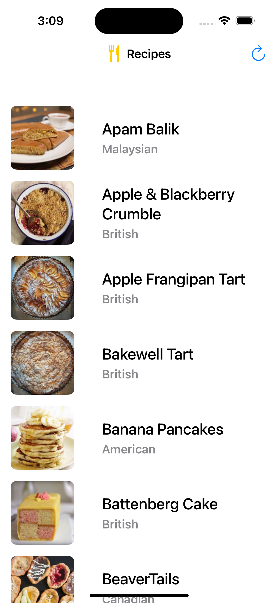
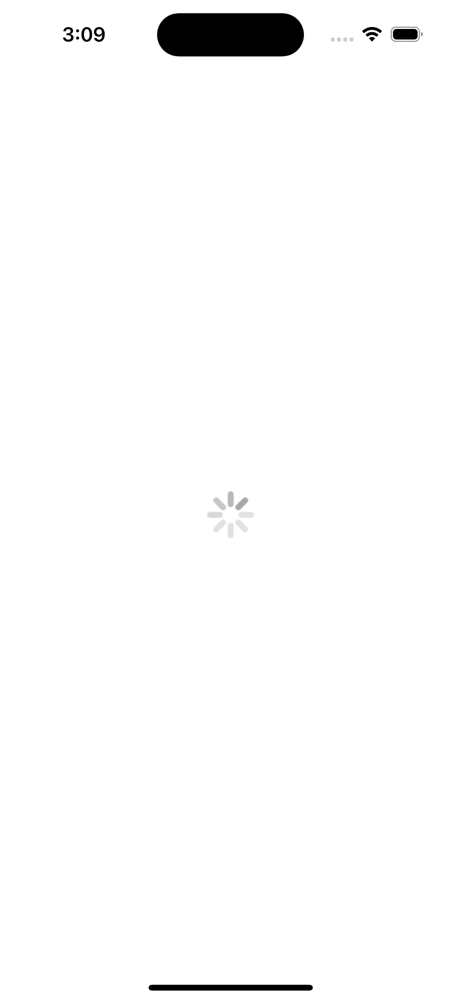

### Summary: Include screen shots or a video of your app highlighting its features

### Focus Areas: What specific areas of the project did you prioritize? Why did you choose to focus on these areas?

I prioritized file organization and code readability to ensure the project is maintainable and scalable. These areas were important to make future updates easier, whether adding new features or enhancing existing functionality.

### Time Spent: Approximately how long did you spend working on this project? How did you allocate your time?

I spent approximately 6 hours on this project. The first 30 minutes were dedicated to reviewing the requirements and planning the implementation. I allocated 4.5 hours to coding the views, implementing the logic, and organizing the code. The final hour was spent on refactoring and further improving code organization.

### Trade-offs and Decisions: Did you make any significant trade-offs in your approach?

My primary focus was meeting the project requirements. Consequently, I opted not to include additional UI elements to ensure the core functionality was fully implemented within the given time frame.

### Weakest Part of the Project: What do you think is the weakest part of your project?

The unit testing aspect is the weakest part of the project. I explored resources to write tests for network requests and caching functionality, but I was unable to implement them comprehensively within the given time constraints.

### Additional Information: Is there anything else we should know? Feel free to share any insights or constraints you encountered.

My current knowledge of unit testing is foundational, which limited my ability to implement more advanced tests for this project. While I am comfortable writing and running basic unit tests, I realized that creating comprehensive tests for network requests, caching, ViewModels, and UI components would require significantly more time and deeper understanding. This is an area I am actively working to improve.
